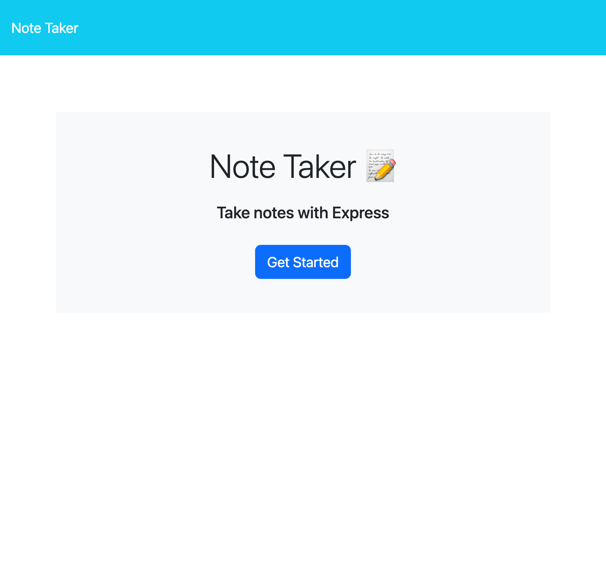
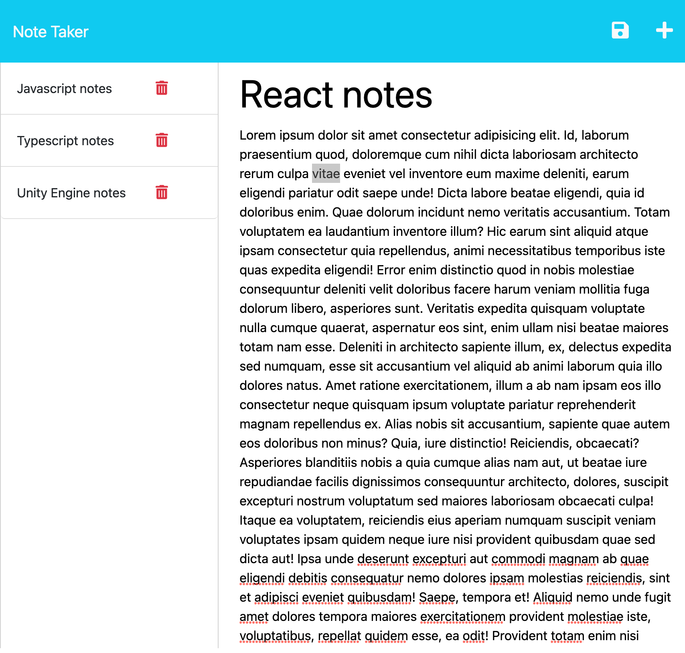

# Note Taker Starter Code

## Description
the reason for this note taking application is to provide the user a simple note taking app where they can write personal notes and add title to the notes that will help orginize their notes.

## Usage
To use this application the user will have to start the app using node. when the app is started the user will be taken to a home page that describes the app. the user will clik the start button and then be taken to the app. the user will be able to write notes and title them with a save button on top. when its clicked the notes will be save to the left of the screen. the user can click the plus sign on top to create a new note and to go back to older notes the user can click on any of the notes on the left side of the screen.
here is a picture of the app 

## License
please refer to the repo

## Installation
-node.js
-express